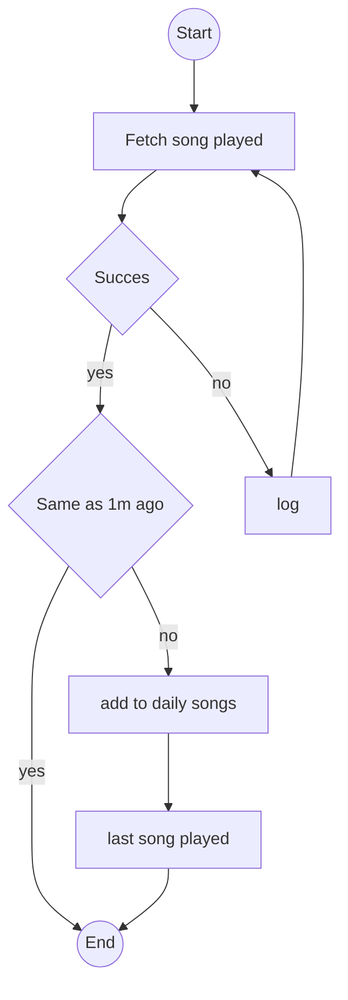
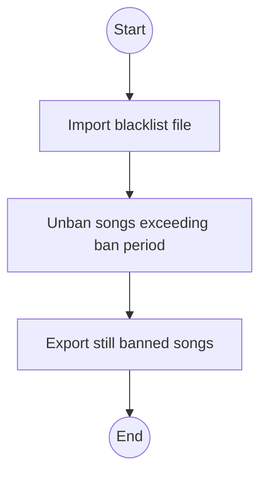
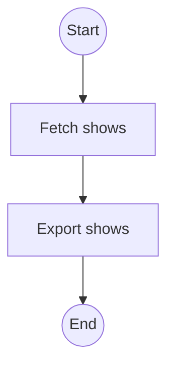

# CH.U.J - Chytrý Umelý Jednobunkovec

Chytrý Umelý Jednobunkovec is a custom Discord Bot for the nonprofit organization Radio [**TLIS**](https://www.tlis.sk/)

---

|version number|version name|
|:---:|:---|
| V1.0.0 | the **Discord APP** update |
| V1.1.0 | the **Useless** update |
| V2.0.0 | the **\"Why the f\*\*\* didn't I write this in Python from the start\"** update |
| V2.1.0 | the **\"I hate naming things\"** update |
| V2.2.0 | the **\"Once upon a time ...\"** update |
| V2.3.0 | the **\"Moby-Dick\"** update |

*V2.0.0 - before this version the Bot was written in Bash

---
The idea for the Bot came from a guy from the PR team.
(The name came as a joke.)

The task was: ***"Create a Discord Bot that would log the names and creators of songs that are playing on our radio throughout the day. He would choose 5 random songs from the logs and send them on discord into a dedicated chat room."***

The Bot's "Mind" is devided into 4 python scripts

- [get_songs.py](#get_songs)
- [CHUJ](#chuj)
- [check_blacklist.py](#check_blacklist)
- [get_episodes.py](#get_episodes)


# get_songs

by using [cron](https://en.wikipedia.org/wiki/Cron) the program is being run every minute from 4:00 to 22:00

```bash
* 4-22 * * * /path/to/python /path/to/get_songs.py >> /path/to/cron_log.txt 2>&1
```



the script fetches the metadata of the current playing song, it takes the **artist** and **songTitle**, check if they're still the same as a minute ago and depending on the output log them or not

# CHUJ

CH.U.J has 5 main commands and 1 secret command:
- [**/help**](#help)
- [**/rerun**](#rerun)
- [**/delete**](#delete)
- [**/blacklist**](#blacklist)
- [**/episodes**](#episodes)

## help

sends a list of possible commands

## rerun

sends 5 random songs

## delete

deletes a message created by the bot

## blacklist

ads the chosen song on a black list for 30 days

## episodes

sends the get_episodes.py log

# check_blacklist

the program is being run, with cron, every day at 1:00

```bash
0 1 * * * /path/to/python /path/to/get_songs.py >> /path/to/cron_log.txt 2>&1
```



the script loads the content of the **song_blacklist.json** songs that exceed the **ban period** (30 days) are filtered out, the rest is still banned until the **ban period** is up

# get_episodes

the program is being run, with cron, every day at 2:00

```bash
0 2 * * * /path/to/python /path/to/get_songs.py >> /path/to/cron_log.txt 2>&1
```



The script fetches metadata for shows that aired on:

- The same calendar date **1, 2, and 3 months ago** in the current year.
- The **same calendar date in each previous year**, back to **2017** (the earliest year with available shows).

The retrieved metadata is then logged.
